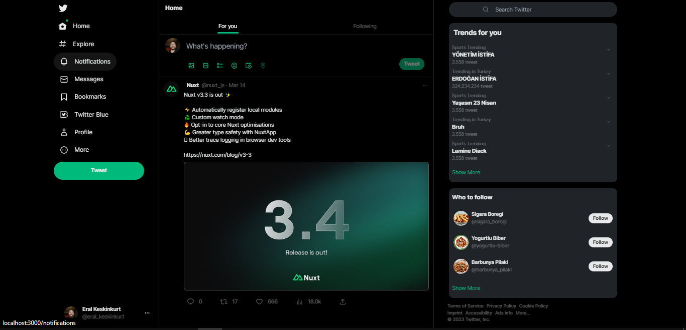

# Twitter Clone

The purpose of this project is to practice and improve with Css and Tailwind. This project is purely for Front end development.

# Languages Used in the Project

- Nuxt-Vue
- Tailwind
- Javascript

### [Live Preview](http://eral-twitter-clone.netlify.app)

# Example Image

# Setup

To run this project, you must first have Node.js and NPM installed. To install them, follow these steps:

1. Download and install the latest version of [Node.js](https://nodejs.org/en/download/).
2. To install NPM, run the following command in terminal:

`npm install -g npm`.

Next, follow these steps to clone the project locally and install the required dependencies:

`   
$ git clonehttps:githubcomTamperMonkeyUppTwitter-Clonegit
`

`
$ cd Twitter-Clone
`

`
$ npm install
`

## Use

Follow the steps below to run the application:

`
$ npm run dev
`

The application will run at `http://localhost:3000`.

